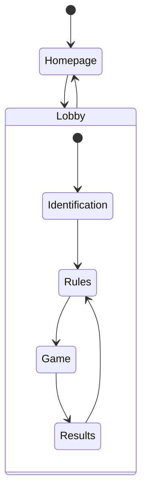

# Hangman (V2)
NodeJS web application created for Application Programming M30221.

## Design
### Aims
 - Allow users to customize their games through a system of rules
 - Limit amount of trust given to clients as much as possible without affecting server performance too much
 - Minimise barriers to entry such as forced accounts etc
 
### Assumptions
 - Hosts will be able to kick players at their discretion thus some trust can be put in the client e.g. for turn timers

### Basic flow


### Practices
#### Variable naming
 - HTML Classes: `dash-case`
 - HTML ID's: `snake_case`
 - JS: `lowerCamelCase`
 - JS (Instantiable): `UpperCamelCase`
 - SQL: `snake_case`

#### File Structure
Includes additional information for files/ folders of note.
```
hangman
│  index.js - Main server script that connects the different components.
│  package.json
│  .nvmrc
│  README.md
│  .gitignore
│
└──storage - Files related to the database
│  │  db.js - Script to provide wrapper functions to interface with the database and add support for async/ await.
│  │  schema.sql - Database initialisation code for the necessary tables
│
└──game - Files related to the logical components of the game
│  │  rules.js
│  │  rules.json - Contains JSON data for all rules
│  │  lobby.js
│  │  game.js
│  │  results.js
│  │  players.js
│  │  words.js - Wrapper for accessing lists contained in the wordlists directory through a dictionary.
│  └──wordlists - JSON files containing all possible words, separated by word length.
│  │  │  getWords.js - Script to filter + convert wordlist CSV into JSON files
│  │  │  ...
│
└──client - Static files for the client.
│  │  index.html
│  │  game.html
│  └──css
│  │  │  ...
│  │
│  └──js
│  │  │  ...
│
└──api - API router that interacts with the logical components.
   │  rest.js - Express router to handle most client interactions.
   │  websocket.js - Websocket server that checks client connections and informs clients of updates.
 ```
 *May not be fully exhaustive of all files included in the repository.*


## Running the server
1. Install NodeJS/ NPM
2. Open the code directory
```bash
cd ./hangman2
```
3. Install npm dependencies
```bash
npm i
```
4. Run the server
```bash
npm start
```

Optionally you may set the following environment variables in a `.env` file in the root directory or by including them in the run command.
```
PORT: The port to be used by the server (defaults to 8080)
```

### Sources
I have used libraries or obtained data from the following sources:
 - [Express](https://www.npmjs.com/package/express)
 - [DotEnv](https://www.npmjs.com/package/dotenv)
 - Words: 
    - [hackerb9/gwordlist](https://github.com/hackerb9/gwordlist)
    - Filtered with: [Bad Words List](https://www.cs.cmu.edu/~biglou/resources/bad-words.txt)